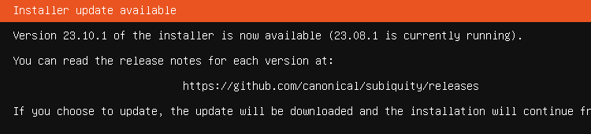
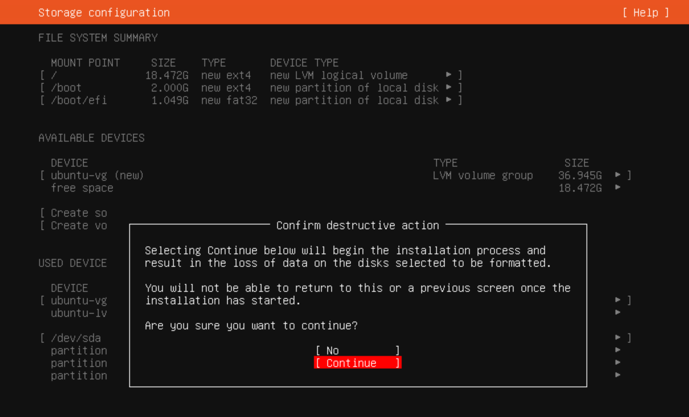

# ESXi上にUbuntuをセットアップする方法

## Ubuntu のダウンロード

[Ubuntuのサイト](https://jp.ubuntu.com/download) から、**Ubuntu Server 22.04 LTS** の最新版をダウンロードします。


## Ubuntuイメージを、ESXiにアップロード

**ESXi Host Client**を開き、「**ストレージ**」のメニューに移り、「**データストアブラウザ**」をクリックします。


**データストアブラウザ**で、**アップロード**ボタンを押し、先ほどダウンロードしたファイルを選択します。


すると、アップロード処理が始まるので、完了までしばらく待ちます。<br>
完了後、以下のように**datastore**に対象ファイルが追加されていることを確認しましょう。


## VM のセットアップ

続いて、「**仮想マシン**」メニューに移り、「**仮想マシンの作成／登録**」をクリックします。


<br><br>

「**1. 作成タイプの選択**」では、「**新規仮想マシンの作成**」を選択します。


<br><br>

「**2. 名前とゲストOSの選択**」では、以下の情報を入力します。
* **名前** : 任意のVM名を入力します。後で変更することも可能です。
* **互換性など** : 以下の図を参考に選択しましょう。


<br><br>

「**3. ストレージの選択**」では、先ほど使用したデータストアが選択されていることを確認し、次に進みます。


<br><br>

「**4. 設定のカスタマイズ**」では、以下の情報を入力した後、「**仮想マシンオプション**」をクリックします。（※. まだ「**次へ**」には行かない）

* **CPU** : 「**2**」 にします。
* **メモリ** : 「**4** (最低)」または「**8** (推奨)」の「GB」にします。
* **ハードディスク1** : 「**40** GB」位あると良いでしょう。
* **CD/DVDドライブ1** : 「**データストアISOファイル**」を選択すると、先ほどの様にデータストアブラウザが開くので、事前にアップロードしたファイルを選択します。


<br><br>

「**仮想マシンオプション**」では、「**VMware Tools**」項目で、「**パワーオン前に毎回 VMware Tools をチェックしてアップグレード**」にチェックを入れておきましょう。その後、「**次へ**」に進みます。


<br><br>

「**5. 設定の確認**」では、内容に誤りがないことを確認し、「**完了**」を押します。


## Ubuntuのセットアップ

「**仮想マシン**」メニューで「**作成したVM名**」を選択すると、**VMの詳細画面**が表示されます。ここで、「**パワーオン**」をクリックし、VMを起動します。


<br><br>


「**画面プレビュー**」（上記のペンギンの絵のあたり）をクリックすると、**コンソール**が起動します。<br>
コンソール画面内をクリックすると、キーボード操作が可能です。<br>
**上下キー**で移動し、**Spaceキー**で選択し、**Enterキー**で決定できます。<br>
ここでは、「**Try or Install Ubuntu Server**」を選びます。


<br><br>

しばらく待つと、Ubuntuの設定画面に変わります。<br>
最初は、**言語の選択**です。Server用途で使うので、そのまま「**English**」にしましょう。


<br><br>

もしDHCP等により、既にネットワークが自動構成されている場合は、ここで新たなバージョンを利用するか聞かれます。<br>
ここでは、「**Continue without updating**」とします。


<br><br>

次は**キーボードレイアウト**です。お使いのキーボードレイアウトに合わせて選択して下さい。


<br><br>

**インストールタイプ**を選択できます。デフォルトの「**Ubuntu Server**」で問題ありません。


<br><br>

**ネットワーク設定**では、お使いの状況に合わせて設定し、次に進みます。
- **DHCP** : 利用可能な場合は、既にIPアドレスが表示されているはずなので、そのまま次に進みます。
- **マニュアル** : 「**ens34**」→「**Edit IPv4**」と選択し、「**IPv4 Method**」を「**Manual**」にすると、手動設定することができます。


<br><br>

**Proxy設定**。直接インターネットに接続できない環境の場合のみ、設定が必要です。


<br><br>

**Ubuntuパッケージのミラーサイト設定**。「**This mirror location passed tests**」を確認し、次に進みます。<br>
必要に応じて、別のミラーサイトを設定することも可能です。


<br><br>

**ストレージ設定**。必要に応じて、**LVM**や**暗号化**などを設定できますが、そのまま次に進みます。


<br><br>

**ストレージ設定の確認画面**。先に進むと、確認ウィンドウが出るので、「**Confirm**」を選択。


<br><br>

**プロファイル設定**。<br>
**あなたの名前**と、**サーバ名**と、ログイン時に使用する**ユーザ名**および**パスワード**を登録します。


<br><br>

**Ubuntu Proサブスクリプション**設定。何も入力しなくても、先に進めます。


<br><br>

**SSH設定**。これは、セットアップ後のリモートログインが容易になるので、**結構重要**です。
* **Install OpenSSH server** : チェック(**X**)を入れる。
* **Import SSH identify** : 事前に**自分のPCの公開鍵**(SSH Public key)を**GitHub**に登録している場合、<br>「**from GitHub**」にすると、その鍵を流用してログインできるようになります。
* **GitHub username** : 上記の設定を行う場合、自分の**GitHubアカウント**を入力します。
* **Allow password authentication over SSH** : チェック(**X**)を入れる。


<br><br>

**追加パッケージの選択**。後で必要なものは個別で入れるので、基本は必要ありません。<br>
次に進むと、インストールが始まります。


<br><br>

インストール完了後は、「**Reboot Now**」を選び、再起動します。


<br><br>

※. 以下のように、「**Failed unmounting /cdrom.**」のメッセージが出る場合、対応が必要です。<br>
1. 「**ESXi Host Client**」の**VM詳細画面**から、「**パワーオフ**」で電源を止めます。
2. 「**編集**」で、「**CD/DVDドライブ1**」を「**ホストデバイス**」にします。
3. 再度、「**パワーオン**」します。


<br><br>

「**(サーバ名) login:**」のプロンプトが表示されれば、セットアップ完了です。コンソールを閉じて下さい。


<br><br>

## Ubuntuへのアクセス

セットアップ中にSSH設定を行った場合、`ssh (ユーザ名)@(サーバ名)` で、SSHログインできます。<br>
今回のセットアップ例の場合、以下のようになります。

```
$ ssh ubuntu@k8s-node1
```

ログインに成功したら、セットアップ完了です。お疲れ様でした！